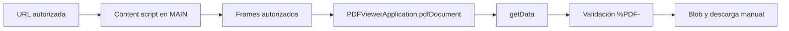

# SAT PDF Local

Extensión local de Chrome para solicitar manualmente una copia del PDF que el visor autorizado de Aduana Digital ya tiene cargado en el navegador.

> **Herramienta local · No oficial · Sin afiliación con SAT Guatemala**

[Descargar `sat-pdf-local-0.1.0.zip`](https://github.com/Anser-dev/PDFgt/releases/latest/download/sat-pdf-local-0.1.0.zip)
El enlace funcionará cuando el ZIP esté disponible en la Release pública correspondiente.

## Inicio rápido

1. Descargá el ZIP desde el enlace anterior.
2. Descomprimilo en una carpeta local.
3. Abrí `chrome://extensions`.
4. Activá **Modo desarrollador**.
5. Elegí **Cargar descomprimida** y seleccioná la carpeta descomprimida que contiene `manifest.json`.
6. Abrí el visor autorizado. Si hay un PDF compatible, aparecerá el botón **Descargar PDF**.

> **Importante:** no es un instalador de doble clic. El ZIP se descomprime y la extensión se carga con **Cargar descomprimida**.

## ¿Qué hace?

- Detecta el visor PDF compatible en cada frame autorizado.
- Habilita una acción manual cuando existe `window.PDFViewerApplication?.pdfDocument.getData`.
- Valida que los bytes comiencen con `%PDF-` antes de solicitar la descarga.
- Genera un nombre local con fecha y hora: `sat-pdf-YYYYMMDD-HHMMSS.pdf`.
- No intenta iniciar sesión, obtener credenciales ni reproducir solicitudes autenticadas.

## Cómo funciona



La configuración declara un único content script en `world: "MAIN"`, con `all_frames: true` y `run_at: "document_idle"`. Cada frame se evalúa de manera independiente. La inyección está limitada al patrón:

```text
https://cdn.c.sat.gob.gt/aduana-digital/*
```

La extensión no extrae el PDF de la red: usa `getData()` del documento que ya expone el visor compatible en la página.

## Privacidad y seguridad

- No hay backend, telemetría, analítica, código remoto ni service worker.
- No se usan cookies, tokens, credenciales, formularios, almacenamiento persistente ni identificadores del documento.
- El PDF permanece en el contexto del navegador hasta crear un `Blob` local para solicitar la descarga.
- La URL temporal del `Blob` se revoca después de la solicitud del navegador.
- La extensión no evade controles de acceso ni afirma compatibilidad futura con el visor.

La descripción completa está en [PRIVACIDAD.md](PRIVACIDAD.md).

## Permisos y superficie exacta

El `manifest.json` no declara `permissions` ni `host_permissions`. Tampoco utiliza las APIs de `downloads`, `tabs`, `scripting`, `storage`, `webNavigation`, `fetch`, `XMLHttpRequest` o `WebSocket`.

| Elemento | Alcance |
| --- | --- |
| `content_scripts.matches` | `https://cdn.c.sat.gob.gt/aduana-digital/*` |
| `world` | `MAIN` |
| `all_frames` | `true`, solo en frames que coincidan con la URL autorizada |
| Acción | Manual, mediante el botón **Descargar PDF** |

## Uso

1. Cargá la carpeta descomprimida desde `chrome://extensions`.
2. Navegá al visor autorizado.
3. Esperá a que el estado indique **PDF disponible para descarga manual**.
4. Presioná **Descargar PDF**.
5. Confirmá la descarga en la ubicación configurada por Chrome.

Si el botón permanece deshabilitado, el visor todavía no expone un documento compatible o la URL/frame no coincide con el alcance declarado.

## Actualización

1. Descargá la nueva Release pública.
2. Descomprimí el ZIP en una carpeta nueva o reemplazá la carpeta anterior.
3. En `chrome://extensions`, presioná **Actualizar** en la tarjeta de la extensión.
4. Recargá la página del visor.

Verificá el archivo descargado con el checksum publicado junto al ZIP:

```bash
cd dist
sha256sum -c sat-pdf-local-0.1.0.zip.sha256
```

## Desinstalación

En `chrome://extensions`, ubicá **SAT PDF Local** y elegí **Quitar**. La extensión no guarda datos persistentes y no requiere una limpieza adicional.

## Solución de problemas

| Situación | Qué revisar |
| --- | --- |
| No aparece el botón | Confirmá que la URL coincida con el patrón autorizado y recargá la página. |
| El botón sigue deshabilitado | El visor debe exponer `PDFViewerApplication.pdfDocument.getData`; esperá a que termine de cargar el PDF. |
| La descarga falla | Recargá el visor y probá nuevamente; el documento puede haber cambiado durante la lectura. |
| Chrome muestra una advertencia | Es esperable al cargar una extensión local no publicada. |
| El ZIP no carga | Descomprimí el archivo y seleccioná la carpeta que contiene `manifest.json`, no el ZIP. |

Usá la extensión únicamente en contextos autorizados y respetá los términos y políticas aplicables del sitio y del navegador.

## Validación conocida

### Ejecutado en este proyecto

- `npm test`: pruebas sintéticas del content script, manifest mínimo, alcance declarado y empaquetado.
- `npm run package`: generación reproducible del ZIP y checksum portable.
- `unzip -l dist/sat-pdf-local-0.1.0.zip`: inspección del contenido del paquete.
- `(cd dist && sha256sum -c sat-pdf-local-0.1.0.zip.sha256)`: verificación del ZIP desde `dist`.
- Dos ejecuciones consecutivas de `npm run package` con comparación del hash SHA-256.

### Pendiente

- Prueba real en Chrome/Chromium con una página local sintética que exponga un visor PDF compatible.
- Validación manual en SAT Guatemala, sin credenciales proporcionadas a la extensión y sin afirmar compatibilidad hasta realizarla.

Los detalles están en [TESTS.md](TESTS.md). Esta documentación distingue las pruebas ejecutadas de la validación pendiente; no promete compatibilidad universal.

## Estructura del proyecto

```text
extension/              Manifest y content script de la extensión
scripts/package.sh      Empaquetado reproducible y checksum
tests/                  Pruebas automatizadas
PRIVACIDAD.md           Datos, límites y controles de privacidad
TESTS.md                Alcance de las pruebas y pendientes
FUENTES.md              Fuentes técnicas consultadas
```

## Desarrollo y empaquetado

Requiere Node.js y las utilidades `bash`, `zip`, `unzip` y `sha256sum`. No hay dependencias npm externas.

```bash
npm test
npm run package
unzip -l dist/sat-pdf-local-0.1.0.zip
(cd dist && sha256sum -c sat-pdf-local-0.1.0.zip.sha256)
```

El ZIP contiene `manifest.json`, `content.js`, `README.md`, `PRIVACIDAD.md` y `FUENTES.md` en su raíz. No incluye tests, scripts ni material local privado.

## Referencias

- [Privacidad](PRIVACIDAD.md)
- [Pruebas](TESTS.md)
- [Fuentes primarias](FUENTES.md)
